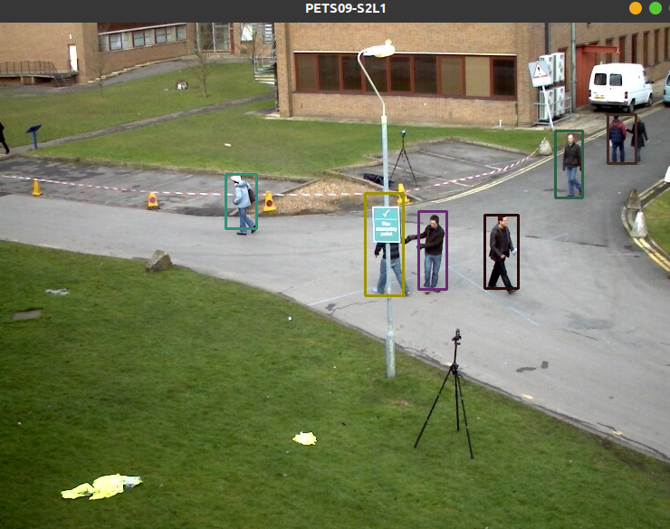
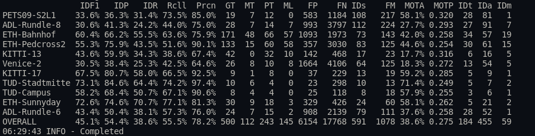

## Introduction
Java implementation of SORT: Simple, online, and real-time tracking of multiple objects in a video sequence.
SORT was initially described in [this paper](http://arxiv.org/abs/1602.00763). At the time of the initial publication, SORT was ranked the best *open source* multiple object tracker on the [MOT benchmark](https://motchallenge.net/results/2D_MOT_2015/).

The original SORT [python implementation](https://github.com/abewley/sort) and [C++ implementation](https://github.com/mcximing/sort-cpp) can be found here.


## Dependencies
- Ubuntu 18.04
- OpenCV 4.5.4
- commons-io-2.11.0

## Demo:

The code is run using [IntelliJ](https://github.com/mcximing/sort-cpp)




To run the tracker with the provided detections and visualize the results:

1. Download the [2D MOT 2015 benchmark dataset](https://motchallenge.net/data/2D_MOT_2015/#download)
2. Create a symbolic link to the dataset
    ```bash
    $ ln -s /path/to/MOT2015_challenge/data/2DMOT2015 /path/to/sort-cpp/mot_benchmark
    ```
3. Run the demo
    
   To enable visualize, set `display=True`


## Evaluate Metrics

Using the [Python implementation of metrics for benchmarking multiple object trackers (MOT)](https://github.com/cheind/py-motmetrics) to evaluate metrics.


#### Dataset Structure

```
Layout for ground truth data
    <GT_ROOT>/<SEQUENCE_1>/gt/gt.txt
    <GT_ROOT>/<SEQUENCE_2>/gt/gt.txt
    ...

Layout for test data
    <TEST_ROOT>/<SEQUENCE_1>.txt
    <TEST_ROOT>/<SEQUENCE_2>.txt
    ...

Example:
mot_benchmark
├── test
│   ├── ADL-Rundle-6.txt
│   └── ADL-Rundle-8.txt
└── train
    ├── ADL-Rundle-6
    │   └── gt
    │       └── gt.txt
    └── ADL-Rundle-8
        └── gt
            └── gt.txt


Sequences of ground truth and test will be matched according to the `<SEQUENCE_X>`
string.
```


#### Example

```bash
# Optional for virtualenv
$ source ~/env/bin/activate
$ pip install motmetrics
# Usage
$ python -m motmetrics.apps.eval_motchallenge --help
# Format: python -m motmetrics.apps.eval_motchallenge groundtruths tests
$ python -m motmetrics.apps.eval_motchallenge mot_benchmark/train output/
```


## Result




## References
1. https://github.com/abewley/sort
2. https://github.com/mcximing/sort-cpp

